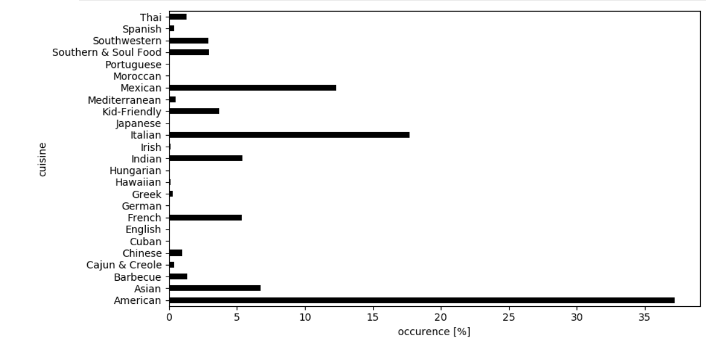

## Milestone 1 (April 8th, 5pm)

**10% of the final grade**

This is a preliminary milestone to let you set up goals for your final project and assess the feasibility of your ideas.
Please, fill the following sections about your project.

*(max. 2000 characters per section)*

### Dataset

> Find a dataset (or multiple) that you will explore. Assess the quality of the data it contains and how much preprocessing / data-cleaning it will require before tackling visualization. We recommend using a standard dataset as this course is not about scraping nor data processing.
>
> Hint: some good pointers for finding quality publicly available datasets ([Google dataset search](https://datasetsearch.research.google.com/), [Kaggle](https://www.kaggle.com/datasets), [OpenSwissData](https://opendata.swiss/en/), [SNAP](https://snap.stanford.edu/data/) and [FiveThirtyEight](https://data.fivethirtyeight.com/)), you could use also the DataSets proposed by the ENAC (see the Announcements section on Zulip).

We are planning to work on [Yummly-28K](http://lherranz.org/local/datasets/yummly28k/Yummly28K.rar), a dataset consisting of 28 thousand recipes crawled from the Yummly personalized recipe recommendation website. Each recipe consists of an image of the dish, its ingredients, its nutritional values and other various data. The dataset has been used mostly for image recognition, but we nevertheless found it suitable. 

While excluding the images for each dish, the dataset is merely available as a folder of 28 thousand files where each file is a 1000-line JSON dictionary consisting of extensive information related to the dish's cuisine, ingredients, macronutrients, micronutrients and their respective units of measurement. We have to extract the prefered and relevant attributes from the JSON files and aggregate them in a CSV file. Furthermore, the ingredient attribute poses a serious preprocessing challenge to our attempt of presenting meaningful statistics and visualizations as the creator of the datasets seems to have concatinated the ingredient's quantity, unit and instruction with the ingredient itself into a single string. Finally, several of the attributes are not of fixed-length so we have to make standardization decisions and transform the data structure to fit our storage format.

There were several similar datasets which contained dishes and their ingredients, similar to this dataset. While none of them were as extensive, they did not require as extensive preprocessing and data cleaning as the Yummly-28k dataset. Nonetheless, because of the comprehensiveness of information presented in this dataset, we found it worthwhile. The processed dataset enables ut to provide interesting and diverse visualizations from multiple facets, whereas with other datasets, we would be limited to work solely with ingredients or averaged nutritional values for a small set of cuisines. 

### Problematic

> Frame the general topic of your visualization and the main axis that you want to develop.
> - What am I trying to show with my visualization?
> - Think of an overview for the project, your motivation, and the target audience.

Overall, our aim with this dataset is to produce educational and multi-faceted insights and visualizations on various cuisines and dishes by clustering and ranking them by their ingredients, flavor and nutritional values which in turn would be used to provide a useful and interactive way of receiving suggestions for new cuisines and dishes.

The nearness of cuisines can be visualized by developing distance metrics and clustering the cuisines by customizable parameters like ingredients used and flavor tendencies. In such case, the project could serve as a useful mechanic for food enthusiasts or travelers to discover new cuisines based on similarities or dissimilarities to familiar cuisines. 

Similarly, we would like to visualize and rank the healthiness of cuisines and dishes by visualizing the deviation of macronutrient, mineral and vitamin content from nutrition recommendations like NAM's Dietary Reference Intake or EFSA's Dietary Reference Values. This educational information could prove beneficial for dieticians, nutritionists, allergists, teachers or for people in general trying to obtain a healthier diet or lifestyle. 

### Exploratory Data Analysis

> Pre-processing of the data set you chose
> - Show some basic statistics and get insights about the data

We could have used some kind of Regex patterns to re-extract and clean up the ingredient attribute from the combined string as mentioned earlier, but trying to get the pattern right would most likely prove unnecessarily time consuming and result in poor performance. Instead, we chose to use a web scraper to retrieve the ingredients from the website directly as the quantity, unit and instruction for each ingredient are located in separate HTML tags. 

Still, there's some variable-length columns that would be more beneficial if were constant-length. We therefore decide to perform some simplifications of the dataset:

- The keys of the 'flavors' dictionary is distributed to six new columns replacing the 'flavors' column as it is either empty or contains the six same keys for each recipe. 

- The 'cuisine' variable length array is replaced by the first item in the array (unless it holds the out-of-place 'kid-friendly' value). We justify this as only a small minority of the dishes' are categorized as multi-cuisine.

After initial preprocessing, performing dataset simplifications and reordering the order of the data, we are left with the following format for each recipe:

id                                                           08923
name                                          Easy Ravioli Lasagna
cuisine                                                    Italian
n_servings                                                       8
time_s                                                        3300
piquancy                                                         0
sweetness                                                   0.1667
sourness                                                    0.1667
saltiness                                                   0.8333
meatiness                                                   0.3333
bitterness                                                  0.8333
energy_kcal                                                2881.53
fat_g                                                        35.78
protein_g                                                    60.53
carbs_g                                                      31.41
vitamin_e_g                                                      0
vitamin_c_g                                                   0.01
vitamin_b12_g                                                    0
vitamin_d_iu                                                  7.02
vitamin_k_g                                                      0
vitamin_a_iu                                               1537.29
vitamin_9_g                                                      0
vitamin_b6_g                                                     0
fatty_acids_g                                                16.33
cholesterol_g                                                 0.12
sodium_g                                                      1.27
fiber_g                                                       5.71
sugar_g                                                       9.17
calcium_g                                                     0.36
iron_g                                                           0
magnesium_g                                                   0.07
zinc_g                                                           0
potassium_g                                                   0.73
url              http://www.yummly.com/recipe/Easy-Ravioli-Lasa...
ingredients      ["italian sausage", "marinara sauce", "crushed...

Below, the distribution of cuisine occurences in the dataset is plotted. It's evident that certain cuisines like the american, italian and mexican cuisines are heavily overrepresented. We would counter this a bit by normalizing the weights of each cuisine during data analysis and working with average values.

### Related work

> - What others have already done with the data?
> - Why is your approach original?
> - What source of inspiration do you take? Visualizations that you found on other websites or magazines (might be unrelated to your data).
> - In case you are using a dataset that you have already explored in another context (ML or ADA course, semester project...), you are required to share the report of that work to outline the differences with the submission for this class.

Our dataset has mostly been used previously for image recognition and for machine learning purposes. It has yet to be used to display the data in an intuitive and interactive way that is useful to people in different ways.

Our approach is unique because we aim to value-add users with our visualizations, rather than just show data analysis like clustering etc. When we looked for other explorations that might be similar to ours, we found the following 2 sites.

https://flowingdata.com/2018/09/18/cuisine-ingredients/

We were particularly intrigued by the scatter plot labeled “INGREDIENT USAGE BY CUISINE”. We found the correlation of ingredients between various cuisines very interesting and we wish to use a similar dataset but with better visuals and interactivity. However, an everyday user cannot do much with the information presented and we aim to do that with our data visualization. 

 https://alioben.github.io/yummly/ 

We found the visualization describing the similarities between various cuisines interesting. However, from a user perspective, we found that the visualizations were not intuitive and so we took some time trying to understand what they were attempting to show. We took that as a pointer for our own visualizations as it just goes to show that despite having good data to show, without good visualization, you might not achieve the intended outcome. 

