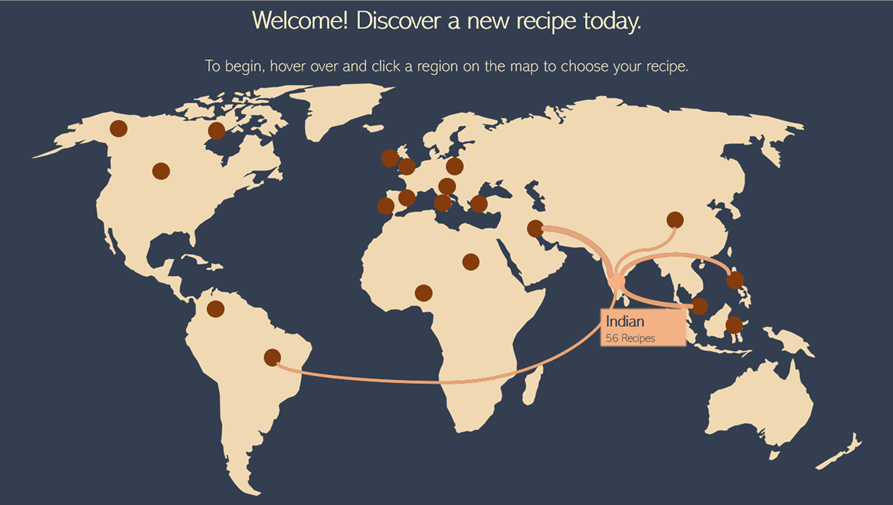
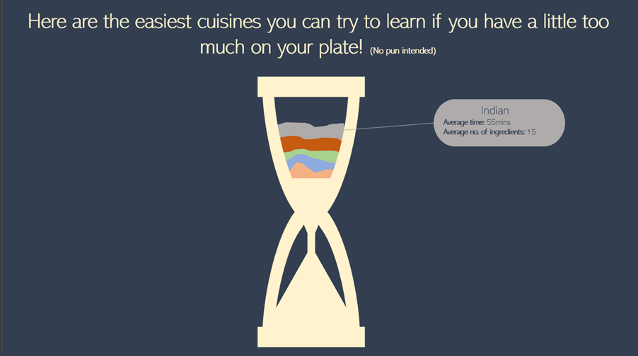
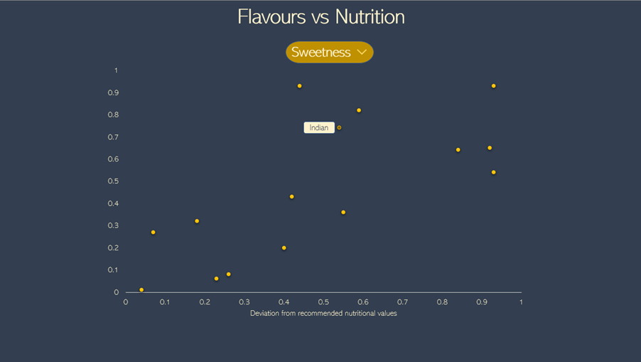

## Milestone 2 (Friday 1st May, 5pm)
**10% of the final grade**

### Our Dataset and Purpose
To recap, we want to provide educational and multi-faceted insights and visualizations on various cuisines by clustering and ranking them by their ingredients, flavor and nutritional values which in turn would be used to provide a useful and interactive way of receiving suggestions for new cuisines and dishes. 

### Structure
We’ve envisioned the structure of our website as a chain of visualizations where each has a unique facet targeted towards a specific use case and target audience. This makes it easy for each user to decide a cuisine and recipe by using a visualization that matches their own prioritizations and preferences.

#### The World Map
First, we want to introduce the user to all of the available cuisines. We chose to do this through a map to give a brief overview of the origins of the cuisines and their relation with other cuisines. The physical origin of each cuisine would be indicated by a circle or a symbol on the map.

The user can interact with the map by hovering over the various cuisines. While hovering over a cuisine, the most similar cuisines would be displayed. This would be done by calculating a closeness score based on parameters like the cuisines’ averaged flavor palettes and the typical ingredients used. The closest cuisines can then be selected either by using a threshold on the closeness score or getting the N cuisines with the highest score. These selected cuisines would then be connected to the hovered cuisine through a line where the thickness is proportional to the closeness score.

Furthermore, hovering over a cuisine would display some basic introductory information like the number of available recipes in our database.

##### Potential expansion
Adding the option to choose what parameter is used to calculate the closeness between cuisines by a drop down menu or a wheel.

#### The Hourglass
Our next session is specifically tailored towards those looking for cuisines which recipes are usually fast to make. This can be those with limited time to cook or those who just don’t find it worthwhile to spend too much time in the kitchen.

By averaging out the time spent attribute for each recipe in a specific cuisine, we could plot the cuisines from least time consuming to the most through a stacked area chart. This could for example be drawn inside of an hourglass to rapidly convey the meaning of the visualization. To make each slice look like sand, we could add sine wave terms with different phases to the average time for each cuisine.

Users would be able to hover each cuisine, which would display the average time and the average number of ingredients required to get a better idea of the complexity of the recipes in the cuisine.  

##### Potential expansion
We could give the user the option of sorting according to time or the ingredients instead of only sorting it by time required. 

#### The flavor-nutrition Scatter Plot
Our third visualization is for those seeking the ability to weigh the nutritional values of cuisines to their preferred flavor composition. This is done through a scatter plot which would plot one of the six flavor attributes with the cuisine’s closeness to recommended nutritional values. The latter would be calculated by squaring the deviation of each nutrition attribute and then taking the square root of the sum. A label of what cuisine the dot represents would then be plotted beside each point. 

##### Potential expansion
We would prefer if we were able to add functionality that would quicker convey which cuisine a dot represents, so it could be possible to add some functionality here where points could easier be distinguished.

An alternative visualization would be to plot the recipes given a cuisine (from a drop down for example) instead of the average of the cuisine itself, as displaying the distribution would be more informative than showing averaged values but would also be more complex on our side to implement. 

#### The Recommendation Section
After the users have been quickly indulged in some of the characteristics of the cuisines, we would want give them some basic functionality to see some recipes of their newly chosen cuisine. This would in its simplest form be a dropdown menu where recipes from the selected cuisine are listed.

### Material required
We are planning to use D3.js to add each chart and provide interactability with drop down menus and buttons. We hence require the use of lectures 4 and 5. 

Each section would also require some specific visualization knowledge:
- the map visualization requires us to utilize general information from lecture 8 about maps to ensure that map parameters like projections are fair, while information about graphs from lecture 10 would be beneficial when drawing the links between the cuisines.  
- the hourglass plot would require information about the stacked area charts from lecture 11 about tabular data.
- the scatter plot would benefit from using the scatter plot guidelines from lecture 11 about tabular data.

Furthermore, resources about the origin locations of different cuisines should be utilized to get accurate placements on the map. 

Finally, we’re planning on using some of the visualization templates from [d3-graph-gallery](https://d3-graph-gallery.com/) as a base for our visualizations and then add application-specific functionality on top. 
